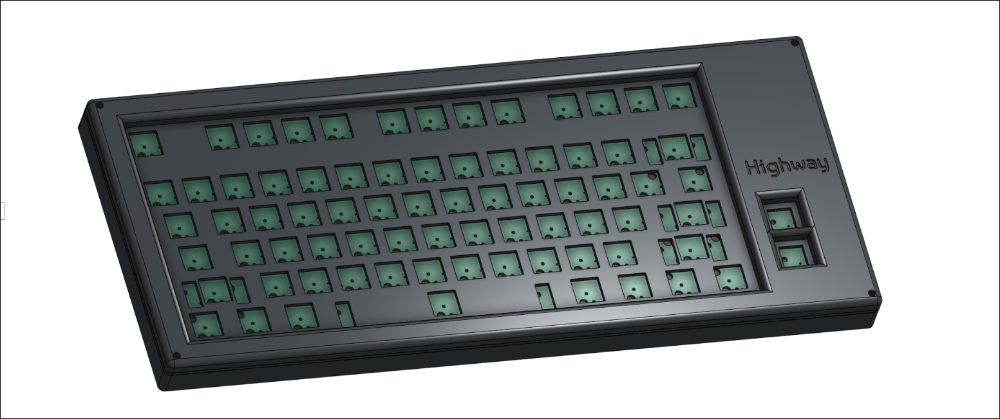
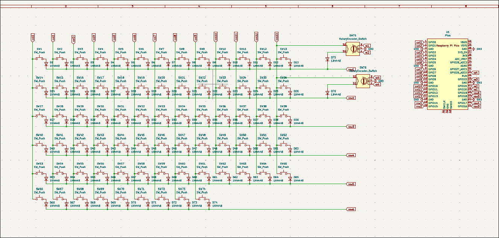
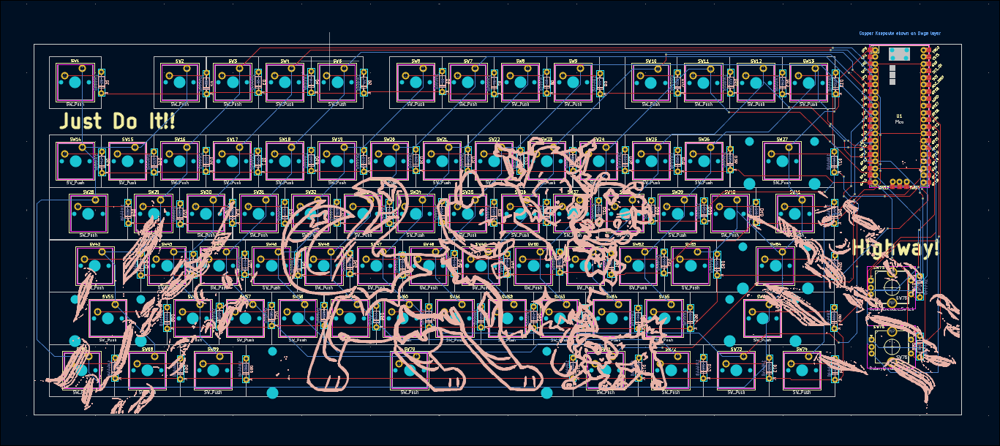
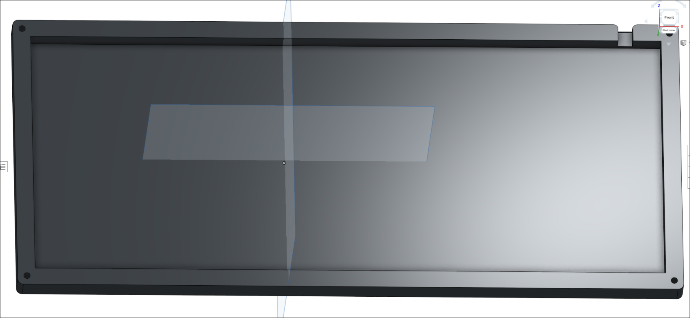
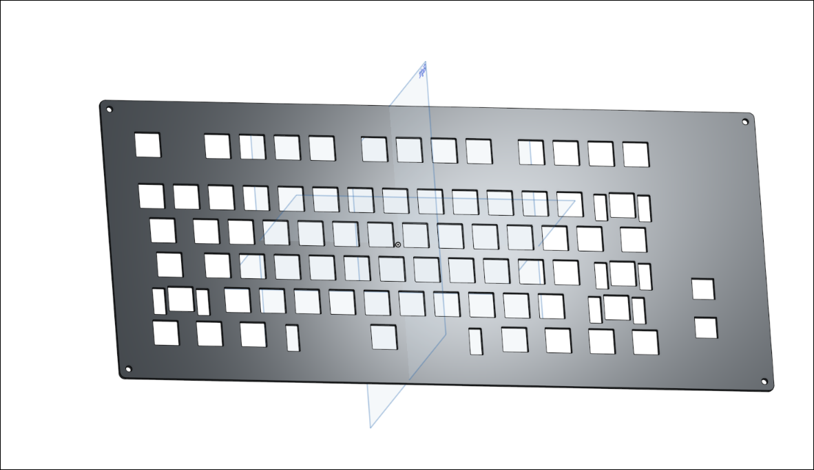
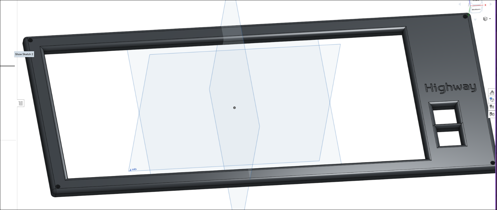
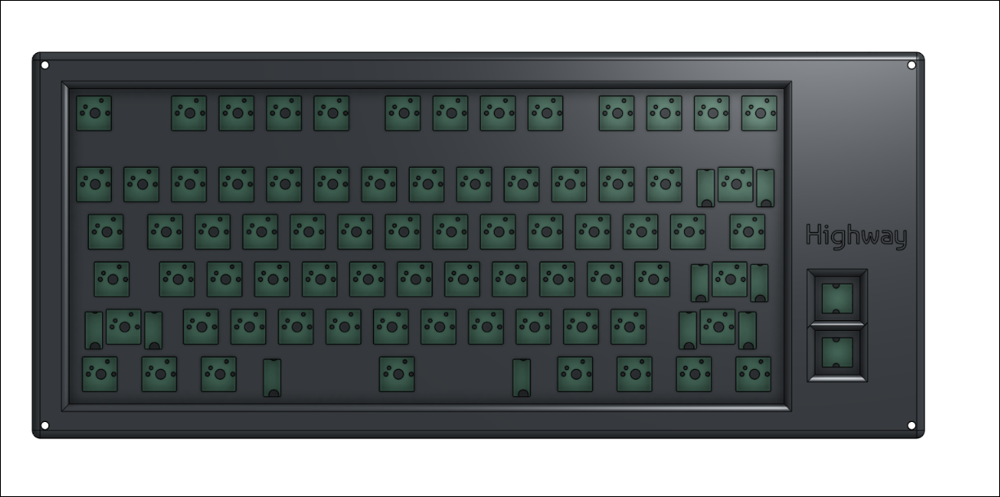

# Keeb

### Why did I make it?
I made it cause I have a freaking 60% keeb and I really need function keys also It has 2 RE which i can use for like brightness or volume stuff.

### What was the hardest part about this ?
It think everthing was cause it's like I love to learn new things so yea I love to make and learn new thing.

Features:

- 2x EC11 Rotary Encoder - For Volume, Brightness etc
- 74x keys
- Raspberry Pi Pico
- Customised layout
- QMK firmware
- Highway branded PCB and case

### Schematic

### PCB 

### Case
- Bottom

- Middle plate

- Top

### 3D view of all parts together 

## BOM

| Name                                                          | Qty | Final Price - INR (USD) | Link                                                                                                                        |
| ------------------------------------------------------------- | --- | ----------------------- | ----------------------------------------------------------------------------------------------------------                  |
| Gateron EF Grayish                                            | 80  | 1560 ($18.19)           | [here](https://neomacro.in/products/gateron-ef-grayish)                                                                     |
| Durock Smokey Screw-In Stabilizers V2 (4+1 w/ 6.25u spacebar) | 1   | 1590 ($18.58)           | [here](https://stackskb.com/store/durock-smokey-screw-in-stabilizers-v2/)                                                   |
| Cherry Profile PBT Keycaps                                    | 1   | 1300 ($15.15)           | [here](https://stackskb.com/store/veekos-gradient-keycaps-cherry-profile-135-keys)                                          |
| Diode 1N4148 Through - Hole                                   | 100 | 100 ($1.17)             | [here](https://amzn.in/d/j3eLvoh)                                                                                           |
| EC11 Rotary Encoder                                           | 2   | 178 ($2.08)             | [here](https://amzn.in/d/hVRxzij)                                                                                           |
| M3 x 20mm Bolt                                                | 15  | 149 ($1.73)             | [here](https://amzn.in/d/8GRQWAB)                                                                                           |
| M3 Nuts                                                       | 8   | 100 ($1.16)             | [here](https://amzn.in/d/7UQtsm8)                                                                                           |
| M3 x 5mm Heatset Insert                                       | 25  | 179 ($2.09)             | [here](https://amzn.in/d/ixybuAc)                                                                                           |
| PCB - (Black Color)                                           | 5   | 6683 ($77.78)           | [here](https://hc-cdn.hel1.your-objectstorage.com/s/v3/74e4c45af47010a7cc1c4b92517cf708e2c89ca2_swappy-20250622-232946.png) |
| Raspberry Pi Pico                                             | 1   | 449 ($5.19)             | [here](http://amazon.in/Raspberry-Pi-Headers-Soldered-Micro/dp/B08WPNM7JB/ref=sr_1_2?sr=8-2)                                |
| Top Case                                                      | 1   | Print Legion            |
| Bottom Case                                                   | 1   | Print Legion            |
| Middle Plate                                                  | 1   | Print Legion            |

## Total Pricing
The total price comes out to be 11,956.35 INR ($139.31) I'm not including the cost of case cause I will get it printed from Print Legion.

The pricing might slightly vary due to flash sales, and dollar market trends.
